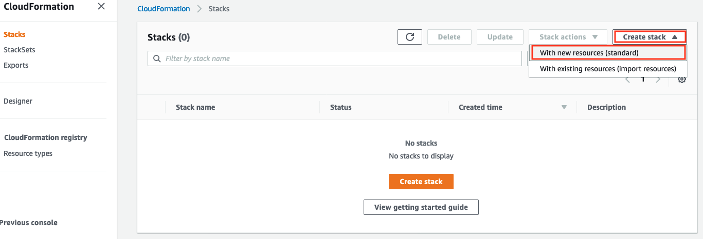
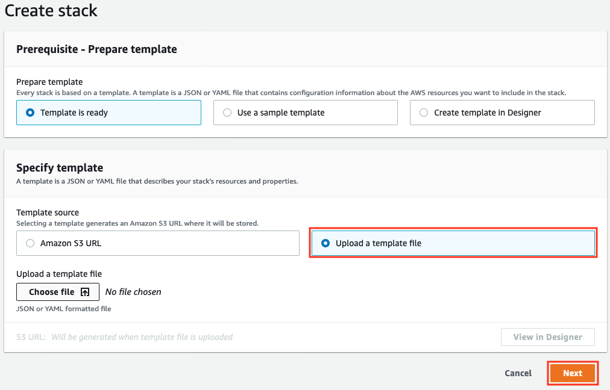
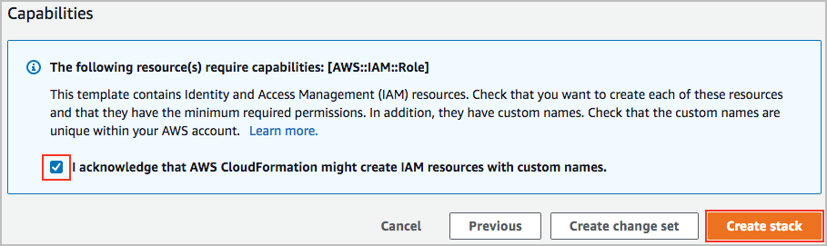

# 使用 Cloudformation 部署多层架构

## 目录
- [目的](#目的)
- [准备](#准备)
- [部署](#部署)
- [理解](#理解)

在这个系列中, 我们通过部署一套电视节目推荐系统, 来学习如何使用 [AWS Cloudformation](https://aws.amazon.com/cloudformation/) 配置和部署可靠且低耦合的架构 (本文的试验内容来自 [AWS Well-architected Labs](https://wellarchitectedlabs.com/) )

## 目的

在完成本文阅读和实践后, 我们将能够:
* 掌握如何自动化部署基础设施
* 理解自动化部署如何保证架构稳定

## 准备
> **消费提醒**
>   本次试验大致花费 **$5.50**, 因为其中我们使用的 NatGateway 会按小时计费.

在开始部署之前, 我们需要有一个 AWS Account 并且有足够的权限来实施我们的部署方案:
* 一个 AWS Account 用来做测试
* 这个 AWS Account 下的一个 IAM user: 有权限执行创建 IAM Roles, EC2 instance,S3 Bucket, DynamoDB table, VPCs, Subnets 和 Internet Gateway.

我们预先下载两个两个用来部署的 yaml 文件, 用来部署 VPC 基础设施的 [vpc-alb-app-db.yaml](https://wellarchitectedlabs.com/Common/Create_VPC_Stack/Code/vpc-alb-app-db.yaml) 和用来部署 web 应用的 [staticwebapp.yaml](https://wellarchitectedlabs.com/Reliability/Common/Code/CloudFormation/staticwebapp.yaml)
_此处, 我们可以将两个文件存入S3 bucket, CloudFormation 支持直接从 S3 bucekt 中导入部署模板, 当然, 我们也可以保存在本机, 通过直接上传模板来部署._
# 部署

下面我们就开始我们的 CloudFormation 部署之旅. 
首先, 我们登录 AWS Console, 然后选择 AWS Region, 这里我选择的是 us-west-2(Ohio)

## 部署 VPC 基础设施
接下来, 我们通过一个 vpc-alb-app-db.yaml 文件部署 VPC 接触设施
1. 进入 [CloudFormation Console](https://console.aws.amazon.com/cloudformation/)
2. 点击 Create Stack, 选择With new resources (standard).

3. 点击 _**Upload a template file**_ 然后点击 _**Choose file**_ (这里我们也可以选择_**Amazone S3 URL**_选项, 然后填入上传到S3 bucket).

4. 选择之前我们下载的 _vpc-alb-app-db.yaml_ 文件, 点击 _**Next**_.
5. 在创建 CloudFormation 信息时候, 我们需要输入信息:
   * **Stack name**: stack 的名字, 这里要输入 _**WebApp1-VPC**_ (注: 一定要输入这个名字, 因为后面我们[部署应用](#部署应用)时候, 部署模板里面通过这个名字来匹配我们创建的 VPC 基础设施).
   * **Parameters**: 这里我们可以都保持 default 值, 不需要特殊配置. ( 因为我们的 yaml 模板里面都设置了 default, 我们会在 [CloudFormation理解](#cloudformation-理解)中具体分析 yaml 文件中的配).
6. 在页面下方点击 _**Next**_.
7. 接下来设置 tags, 我们一般会使用 tags 标识和管理我们的 stacks. 我们可以使用 _Owner_ 做 key, 我们的 email 地址做 value, 然后点击 Next.
8. 接下来是review 页, 用来 review 我们配置的信息, 如果无误, 勾选页面下方的 _**I acknowledge that AWS CloudFormation might create IAM resources with custom names**_, 然后点击 _**Create Stack**_. 

9. 这时, 我们在 yaml 文件中描述的资源已经在被 CloudFormation 创建了. 我们需要等待几分钟, 知道 stack 的状态从`CREATE_IN_PROGRESS` 到 `CREATE_COMPLETE`. 
## 部署应用
当上一步中 _**WebApp1-VPC**_ stack 状态变为 `CREATE_COMPLETE`, 我们就可以开始在 CloudFormation 中部署 Web 相关的资源了.

# 理解
## 架构理解
我们将通过两个 AWS Cloudformation 模板, 部署一套可靠的多层 AWS 云端架构. 其中一个模板是用来部署一个 Amazon VPC, 另一个模板是用来部署一个搭建在跨 AZ(Available Zone) 的多 EC2 实例的三层 web 服务器:

* A. 每个 AZ 都会部署一个 EC2 instance.
* B. 当我们刷新页面时候, 会发现我们的流量每次会随机打在某一个 instance.
* C. 在这里我们用到了 ALB, 在收到请求后, 分发到某个 EC2 instance 处理.
   * 在这个架构中, 我们的request是无状态的(stateless), 所以可以被 route 任何一个 EC2 instance 上.
* D.EC2 instance 的数量由 [Amazon EC2 Auto Scaling Group](http://aws.amazon.com/ec2/autoscaling) 来维护, Auto Scaling Group 会根据配置的不同指标, 如 CPU, 请求数量, 来动态 scale up 或 down EC2 instance 的数量. 在这个架构中, Auto Scaling Group 负责维护三个 EC2 instance, 加入一个 instance 被检测出来 unhealthy, 这个 instance 将会被替换掉, 以维持一直都有三个healthy instance在 serve.
*  NAT network 和 Internet Gateway: 每个 subnet 都有一个 NAT Gateway用来提供地址转换, 帮助subnet 与 public network 交互. 同时, 我们为VPC 配置了一个 Internet Gateway 用以提供 public network 访问.
  

这是一个典型的 reliability 的最佳实践: 
* 高可用的(HA, high available)网络连接: 要求架构中每个 endpoint 和routing都必须是高可用的. 为了达到这点, 我们使用了:
  *  ALB 以提供横跨多个 AZ 的 7 层(http/https)或 4 层(TCP)的链路.
  *  Auto Scaling Group 来提供一套可自愈的, 根据流量动态调整的架构.
* 松散耦合: 低耦合帮助隔离组件变化, 以增加系统韧性和灵活性. 如我们用到的 ALB 帮助我们分发流量到不同 AZ 中的instance 上, 我们可以轻松的增加/减少 instance, 而不会对其他 instance 造成影响.

当然, 我们还可以把将我们的应用部署到多 regions 以提高可靠性. 另外, 我们还可以为每一层添加监控, 错误检测及自愈策略. 

## CloudFormation 理解